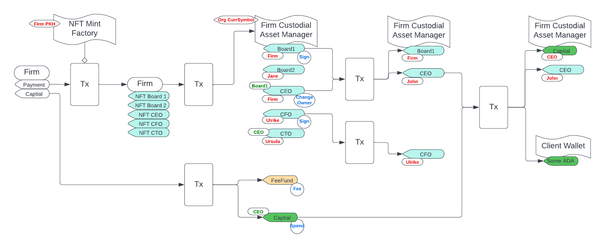

# Rationale

This project aims to provide a single script wallet for a fully transparent organization like an NGO. It consist of different types of asset locked in the script, namely, NFTs for managing roles and permissions, Funds whose permission is tied to the NFTs, Fees Fund as a common fund used for transaction fees. The following diagram shows the different scenarios for unlocking or modifying the the different assets.

